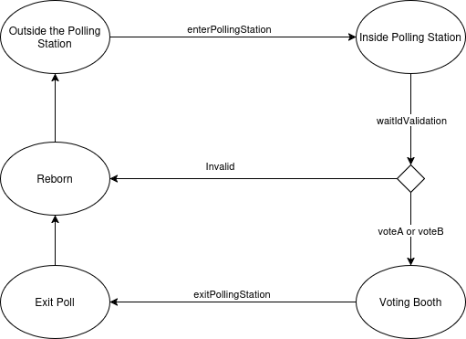

# Election Day Simulation - Implementation Breakdown

## 1. Core Components and Interactions

### Key Entities

- **Voters**: Enter polling station, get ID validated, vote, participate in exit polls, and possibly "reborn"
- **Poll Clerk**: Manages polling station operations, validates IDs, and processes voters
- **Pollster**: Conducts exit polling and compiles results

- **Polling Station**: Controls voter entry and queue management
- **Exit Poll**: Collects and analyzes voter responses after voting

## 2. Monitored Components
### 1. MPollingStation
- Manages voter entry, ID validation, and voting processes
- Controls station opening/closing and queue management
- Counts votes for candidates A and B
- Implements concurrency control through ReentrantLocks and Conditions

### 2. MExitPoll
- Handles voter participation in exit polling
- Collects voter responses with probability factors for selection and honesty
- Compiles and reports exit poll predictions
- Manages synchronization between voters and pollster

## 3. Thread Behaviors and Lifecycles

### TVoter Lifecycle
1. Attempts to enter polling station
2. Waits for ID validation
3. If approved, casts vote for candidate A (40% chance) or B (60% chance)
4. Exits and possibly participates in exit poll
5. Reborns with 50% probability (either with same ID or new ID)
6. Repeats process while polling station remains open

### TClerk Lifecycle
1. Opens polling station
2. Calls next voter and processes them until maximum votes reached
3. Closes polling station for new voters
4. Continues processing remaining voters in queue
5. Signals exit poll to close after processing queue

### TPollster Lifecycle
1. Continuously inquires for new exit poll responses
2. Processes voter responses when available
3. Terminates when exit poll closes
4. Prints final exit poll results

## 4. Synchronization and Concurrency Management

### Data Structures & Operations
- **Queue<Integer> votersQueue**: 
  - Implemented as `ArrayDeque<Integer>` in MPollingStation
  - Operations: `offer()`, `poll()`, `isEmpty()`, `size()`
  - Stores voter IDs waiting in the polling station
  
- **HashSet<Integer> validatedIDs**:
  - Tracks already validated voter IDs to prevent duplicate voting
  - Operations: `contains()`, `add()`
  
- **Counter Variables**:
  - `candidateA` and `candidateB`: Track votes for each candidate
  - `votesForA` and `votesForB`: Count exit poll responses
  
- **State Flags**:
  - `isOpen`: Indicates if polling station is accepting new voters
  - `aboutToClose`: Signals exit poll is preparing to close
  - `isAproved`: Stores ID validation result
  - `newVoteReady`: Indicates new exit poll response is available
  - `registeredVote`: Stores the actual exit poll response

### Key Synchronization Mechanisms
- **ReentrantLocks**: Used in both monitors to control access to shared resources
- **Condition Variables**: 
  - `stationOpen`: Signals when polling station opens
  - `notEmpty`/`notFull`: Control queue access
  - `aprovalReady`: Coordinates ID validation
  - `voterReady`/`pollsterReady`: Synchronize exit poll interactions

### Critical Sections
- **Voter Queue Management**: 
  - Protected by `queue_lock` in MPollingStation
  - Uses conditions to prevent overflow/underflow
- **ID Validation Process**:
  - Ensures unique voting through HashSet validation
  - Coordinates between clerk and voter threads
- **Voting Booth Access**:
  - Protected by `voting_lock` to ensure single voter access
- **Exit Poll Interactions**:
  - Coordinated exchange between voter and pollster

## 5. Implementation Features

### Speed Control
- GUI provides simulation speed control
- Thread sleep times are adjusted by speed factor throughout all components

### Voter Behavior Modeling
- Randomized voting preferences (40% A, 60% B)
- Exit poll participation is probabilistic:
  - Percentage-based selection for questioning
  - 40% decline to answer
  - 20% provide false information

### Lifecycle Management
- Singleton pattern used for most components
- Auto-termination after reaching vote threshold
- Proper handling of remaining queue after closing